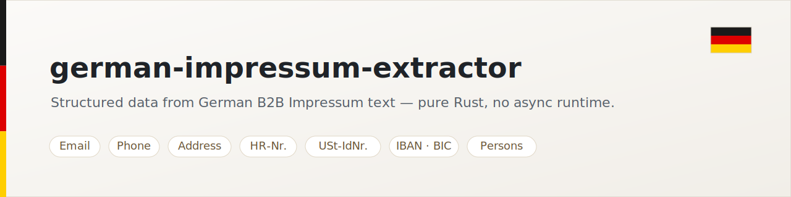

<p align="center">
  <picture>
    <source media="(prefers-color-scheme: dark)" srcset="assets/banner-dark.svg">
    
  </picture>
</p>

<p align="center">
  <a href="https://github.com/Liohtml/german-impressum-extractor/actions/workflows/ci.yml"></a>
  <a href="Cargo.toml"></a>
  <a href="#license"></a>
  <a href="https://github.com/rust-secure-code/safety-dance/"></a>
</p>

# german-impressum-extractor

Extract structured data from German B2B website Impressum text — pure Rust, no async runtime needed.

Germany's [TMG §5](https://www.gesetze-im-internet.de/tmg/__5.html) requires every commercial website to publish an "Impressum" listing the legal entity, managing directors, address, contact info, and tax identifiers. This crate gives you a battle-tested parser for that data.

## What it extracts

- 📧 **Email addresses** — plain (`info@firma.de`) and obfuscated (`info [at] firma [dot] de`). False positives from code fragments (`…@….css`) and prose (`…matters. Discover…` → `th@matters.discover`) are filtered via a real-TLD allowlist.
- ☎️ **Phone numbers** — normalized to `+49…` form regardless of input format.
- 📠 **Fax / Telefax** — labeled fax numbers, kept separate from `phones`.
- 🏠 **Address** — German postcode + city + street with house number.
- 🪪 **HR-Nummer** — Handelsregister number (e.g. `HRB 12345 B`).
- 🏛️ **HR court** — registration court (e.g. `Amtsgericht Berlin (Charlottenburg)`).
- 💶 **USt-IdNr.** — German VAT ID (`DE` + 9 digits, also with grouping spaces `DE 123 456 789`).
- 🧾 **Steuernummer** — local tax number, incl. abbreviations (`St.-Nr.`, `StNr.`, `Steuer-Nr.`).
- 🏦 **IBAN / BIC** — German bank details (`Bankverbindung`).
- 🏢 **Legal form** — `GmbH`, `GmbH & Co. KG`, `GmbH & Co. KGaA`, `KGaA`, `UG`, `AG`, `KG`, `OHG`, `GbR`, `e.K.`, `eG`, `SE`.
- 📅 **Year founded** — `gegründet 1973` / `seit 1985` / `founded in 1990`.
- 👥 **Persons** — Geschäftsführer / Inhaber / Vorstand / Verantwortlicher (§18 MStV) with role tag.

## Why not just regex it yourself

Because German B2B websites have hundreds of edge cases:

- Phone: `+49 (0) 30 / 1234 5-67` vs `0030 12 345-678` vs `030 / 12345/678`
- Names: `Dr. h.c. Hans-Peter von der Mühle und Anna Schmidt-Lutz` should yield two distinct people.
- Postcodes vs random 5-digit numbers: `12345` is not always a postcode.
- Legal forms with `&`: `GmbH & Co. KG` vs `GmbH & Co. KGaA` vs just `GmbH`.

This crate ships 40+ unit and regression tests covering these cases, runs `clippy -D warnings` in CI, verifies its 1.85 MSRV, and is used in production lead-gen pipelines.

## Usage

> **Note:** this crate is not yet published on crates.io. Add it as a git dependency:

```toml
[dependencies]
german-impressum-extractor = { git = "https://github.com/Liohtml/german-impressum-extractor" }
```

Once published, this will become `german-impressum-extractor = "0.1"`.

### One-shot extract

```rust
use german_impressum_extractor::extract_all;

let text = std::fs::read_to_string("impressum.txt").unwrap();
let data = extract_all(&text);

println!("Legal form: {:?}", data.legal_form);
println!("Email:      {:?}", data.emails);
println!("Phones:     {:?}", data.phones);
println!("Persons:    {:?}", data.persons);
```

### Granular extractors

Each field has a separate function if you only need part of the picture:

```rust
use german_impressum_extractor::{
    extract_emails, extract_phones, extract_fax, extract_persons,
    extract_address, extract_legal_form, extract_vat_id, extract_tax_number,
    extract_hr_number, extract_hr_court, extract_iban, extract_bic,
    extract_year_founded,
};

let text = "Geschäftsführer: Hans Müller, Tel: +49 30 1234567";

let emails  = extract_emails(text);
let phones  = extract_phones(text);
let fax     = extract_fax(text);
let persons = extract_persons(text);
let (postcode, city, street) = extract_address(text);
let legal_form  = extract_legal_form(text);
let vat_id      = extract_vat_id(text);
let tax_number  = extract_tax_number(text);
let hr_number   = extract_hr_number(text);
let hr_court    = extract_hr_court(text);
let iban        = extract_iban(text);
let bic         = extract_bic(text);
let founded     = extract_year_founded(text);
```

All granular `extract_*` functions normalize their input the same way `extract_all` does (Unicode/whitespace cleanup, HTML-entity decoding), so calling them directly gives the same result as the corresponding field of `extract_all`.

### Multiple addresses

`extract_address` returns the first address; for pages listing several
locations use `extract_addresses`, which returns one `Address` per address
block (components are never mixed across blocks):

```rust
use german_impressum_extractor::extract_addresses;

for a in extract_addresses(impressum_text) {
    println!("{:?} {:?} {:?}", a.street, a.postcode, a.city);
}
```

### Confidence scores

Need to know how much to trust each field? `extract_all_scored` returns the
same data with a per-field confidence in `0.0..=1.0` (heuristic: format
validity such as an IBAN mod-97 check, plus a boost when the source page
labels the field):

```rust
use german_impressum_extractor::extract_all_scored;

let d = extract_all_scored(impressum_text);
if let Some(iban) = d.iban {
    println!("{} (confidence {:.2})", iban.value, iban.confidence);
}
```

`extract_all` is unchanged; scoring is purely additive. With the `html`
feature, `extract_all_scored_html` does the same from raw HTML.

### `serde` support (optional)

```toml
[dependencies]
german-impressum-extractor = { version = "0.1", features = ["serde"] }
```

The `Extracted` and `Person` types then derive `Serialize` + `Deserialize`.

### From HTML directly (optional `html` feature)

```toml
[dependencies]
german-impressum-extractor = { version = "0.1", features = ["html"] }
```

```rust
use german_impressum_extractor::{extract_all_html, html_to_impressum_text};

let data = extract_all_html(html_page);            // parse + extract in one step
let text = html_to_impressum_text(html_page);      // just the cleaned text
```

Without the feature, keep feeding plain text to `extract_all` — the default build pulls no HTML dependencies.

## Examples

```bash
cargo run --example basic
```

## Robustness & limits

- ✅ Handles `ä`, `ö`, `ü`, `ß`, double-letter substitutions (`ae`, `oe`, `ue`, `ss`).
- ✅ Tested on dozens of real German cleaning-industry Impressum pages in production.
- ⚠️ Extraction is regex-based; some unusual layouts may produce noise. The `persons` field in particular benefits from a downstream cleanup step that filters obvious non-names (e.g. you may want to drop `last_name == "Geschäftsführung"`).
- ⚠️ Address regex finds the *first* postcode/street in the text. If the page contains multiple legal entities or branch addresses, use `extract_addresses` to get all addresses; `extract_address` returns only the first.

## Contributing

Issues and PRs welcome. Please:

1. `cargo test` passes
2. New regex patterns ship with at least one test case derived from real-world text
3. Run `cargo fmt` + `cargo clippy --all-targets`

## License

Licensed under either of:

- Apache License, Version 2.0 ([LICENSE-APACHE](LICENSE-APACHE))
- MIT License ([LICENSE-MIT](LICENSE-MIT))

at your option.
